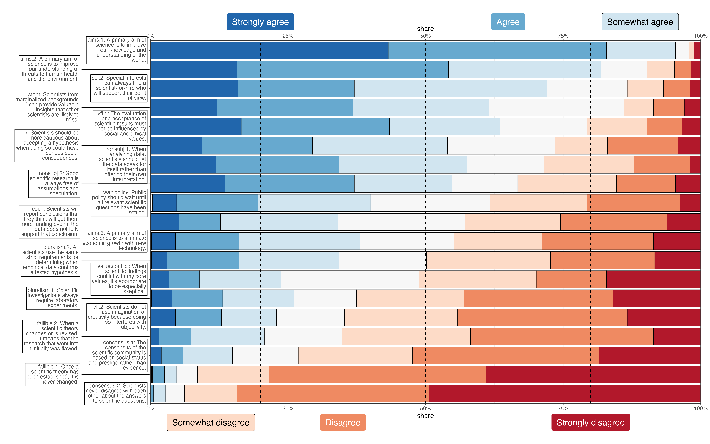

| 
| Keywords: values in science, trust in science, survey instrument, philosophy of science, factor analysis

```{r}
#| label: setup
#| include: false
library(tidyverse)
library(knitr)
library(gt)
library(here)
library(tinytable)
```

# Introduction #

Historians, philosophers, and sociologists of science and technology ("HPSTS scholars") who study public scientific controversies often propose explanations for these controversies that refer to views of publics on the relationship (actual or normative) between science, values, and policy.  For example, members of the public may be thought to hold simplistic views of "the scientific method" [@MercerWhyPopperCan2016; @JohnEpistemicTrustEthics2017] or misunderstand the role of consensus and dissent in science [@OreskesScientificConsensusClimate2004; @CookQuantifyingConsensusAnthropogenic2013; @JohnEpistemicTrustEthics2017; @MyersConsensusRevisitedQuantifying2021; for contrast see @SlaterPublicConceptionsScientific2024].  There might be a critical mismatch between the traditional conception of objectivity or "value-free" science, on the one hand, and the value-laden reality of science, on the other [@BrightBoisDemocraticDefence2017; @HavstadNeutralityRelevancePrescription2017; @JohnEpistemicTrustEthics2017; @FernandezPintoLegitimizingValuesRegulatory2019; @KovakaClimateChangeDenial2021; @HolmanNewDemarcationProblem2022; @MetzenObjectivitySharedValues2024].  Or the public might have concerns (justified or not) about technocratic paternalism [@WynneSheepfarmingChernobylCase1989; @JordanTrustworthinessResearchParadigm2011; @LargentVaccineDebateModern2012; @NavinValuesVaccineRefusal2015; @GoldenbergVaccineHesitancyPublic2021], conflicts of interest and "manufacturing doubt" [@OreskesScientificConsensusClimate2004; @FernandezPintoKnowBetterNot2017; @ElliottSciencePolicyTransparency2014; @FernandezPintoCommercialInterestsErosion2020; @GoldenbergVaccineHesitancyPublic2021], or science's historical and contemporary roles in oppression, especially of women and people of color [@SchemanEpistemologyResuscitatedObjectivity2001; @WashingtonMedicalApartheidDark2008; @McHughMoreSkinDeep2011; @NelsonBodySoulBlack2011; @GrasswickUnderstandingEpistemicTrust2018;  @GoldenbergVaccineHesitancyPublic2021].  

However, in the citations above, there is little empirical evidence to support key claims that members of the public actually hold the views attributed to them.  Historians have carefully tracked the activities of scientists and industry actors to manipulate perceptions of a scientific consensus on climate change; but assume that public acceptance of climate science or policy depends on these perceptions [@OreskesResponseOreskesCounting2017].  Sociologists of science often provide rich accounts of particular cases, rooted in ethnographic fieldwork [e.g., @WynneSheepfarmingChernobylCase1989; @OttingerRefiningExpertiseHow2013].  But these cases don't obviously generalize to other cases or the general public.  And philosophers frequently provide no empirical evidence at all [@SteelScientistsAttitudesScience2017].  In the best cases, they're explicit about providing theoretically-informed speculation and questions for future empirical research [@KovakaClimateChangeDenial2021].  

There is a substantial body of empirical research on scientific literacy and understanding of the nature of science (NOS) among the general public.  However, the instruments used in this research generally focus on "science facts" (e.g., "Electrons are smaller than atoms. True or false?"), scientific reasoning ("Imagine that we roll a fair, six-sided die
1000 times. Out of 1000 rolls, how many times do you think the die would come up as an even number?"), or research processes and the epistemology of science ("Scientific theories are subject to ongoing testing and revision") [first and second examples from @KahanOrdinaryScienceIntelligence2017; third example from @WeisbergKnowledgeNatureScience2020; see also @HuxsterUnderstandingUnderstandingPublic2017; @SlaterUnderstandingTrustingScience2019].  Much less attention is paid to the relationship between science and society or the role of values in science [@MontuschiUnderstandingWhatPublic2024].  For example, @WeisbergKnowledgeNatureScience2020 used a NOS instrument to study predictors of attitudes to evolution.  In their preregistration document (<https://osf.io/dncj4>), this instrument is characterized more specifically as measuring participant views on the "Epistemology of Science," and none of the 23 items in the instrument cover the relationship between science and society or values in science. 

Similarly, there is a substantial empirical literature on public trust in science. This literature often considers the role of religion, political affiliation, and various interventions (e.g., how scientists present themselves) in shaping trust in science. And some instruments for measuring trust in science have been based on the work of feminist ethicist Annette Baier [@HendriksMeasuringLaypeoplesTrust2015]. But otherwise the trust in science literature has not significantly engaged with the kinds of issues explored in recent philosophical work on science and values. 

For example, much of the philosophical literature on values in science has focused on arguments against (and sometimes for) the value-free ideal (VFI). Defenders of VFI argue that non-epistemic values are irrelevant to the epistemic aims of science and can lead to methodological errors and false conclusions, and because of this VFI is essential for public trust in science [@BrightBoisDemocraticDefence2017; @HavstadNeutralityRelevancePrescription2017; @JohnEpistemicTrustEthics2017; @FernandezPintoLegitimizingValuesRegulatory2019; @KovakaClimateChangeDenial2021; @HolmanNewDemarcationProblem2022; @MenonSisypheanScienceWhy2023; @MetzenObjectivitySharedValues2024]. 

But does public trust in science depend on VFI?  This is an empirical question, and none of the works just cited provide empirical evidence to answer it, one way or the other. 

To our knowledge, the only empirical studies of public views on VFI are @ElliottValuesEnvironmentalResearch2017 and @HicksValuesDisclosuresTrust2022, the latter of which is a replication and re-analysis of the former.  In an online survey experiment, @HicksValuesDisclosuresTrust2022 found that disclosing public health values might increase, rather than decrease, trust in the disclosing scientist, conflicting with many claims that VFI supports trust.  

The project reported here aimed to fill these gaps by developing the Values in Science Scale (VISS): a survey instrument that could be used to measure public views on the relationship between science, values, and policy, and thereby better test the kinds of empirical generalizations made by HPSTS scholars.  

*[update roadmap]* In the next section we provide some additional motivation for the project, and discuss the initial development of VISS. We then proceed through the three empirical studies, and conclude with a more philosophical general discussion. 


# Development of VISS items

*[intro: drafting; developmental studies 1 and 2]*

## Initial drafting

As a survey instrument for use with the general public, we wanted the Values in Science Scale to comprise a series of accessible, clearly-written prompts, with a Likert-style quantitative response (that is, a 5- or 7-step agree/disagree scale). 

Initial development of the list was conducted by [author1], a philosopher of science, who developed 3 prompts for each of 12 different major issues or areas of research in the philosophical literature, for a total of 36 initial prompts.  Some prompts were based on other instruments [@ORourkePhilosophicalInterventionCrossdisciplinary2012; @WeisbergKnowledgeNatureScience2020] or claims made in scholarly sources [@KovakaClimateChangeDenial2021]; others were written by [author1] to capture a key idea from a line of inquiry or debate within HPSTS.  We briefly review the relevant philosophy of science literature for each of the 12 issues/areas in @sec-lit-review.  The first two columns of @tbl-compare contain the original items from the first version of VISS. Each item is a declarative sentence of approximately 15-20 words, and participants are asked to agree or disagree with each item on a 5-point Likert scale (later expanded to 7 points).  

After the initial VISS items had been drafted, [author2], a cognitive psychologist, developed an online survey study design and analysis plan, applying factor analysis techniques (briefly explained in the next two paragraphs) to understand the correlational structure of responses to the prompts by members of the general public. We were interested in both responses to individual items and identifying potential latent factors or clusters of items. 

Factor analysis is a collection of statistical methods that models observed data as measures of one or more unobserved or latent variables, called *factors*. For example, in personality research, the "Big Five" model might be used to represent responses to 40 survey items as measures of five latent personality traits. In realist terms (which we don't necessarily endorse), the latent factors might be interpreted as unobserved common causes of the observations; or, in an antirealist vein, as constructed groups or clusters of correlated items that function as a kind of cognitive shorthand. Each observed variable (for example, a particular survey item) has a numerical *loading* on to each factor; typically the statistical aim is for each variable to have a high loading on exactly one factor and approximately zero loading on the others. Given a set of loadings, a *score* can be calculated for each unit of observation (for example, each respondent to the survey) along each factor. 

*Exploratory* factor analysis (EFA) does not assume any particular factor structure (number of latent variables or which observed variables load on to which factors) and aims to construct a series of models — usually distinguished by the number of factors — then identify the model with best fit to the data and, often, offer an interpretation of what the factors in this model might represent. *Confirmatory* factor analysis (CFA) starts with a particular factor structure as a hypothesis of interest, and aims to test this hypothesis by analyzing the goodness of fit on new data (that is, data that was not used in EFA). 

We emphasize that the VISS prompts are theoretically-informed but were not developed to capture *a priori* latent factors.  For example, the three "aims of science" prompts state that the aims of science are knowledge for its own sake, the protection of human health, and economic growth.  We did not expect responses on these items to be strongly correlated, and so did not expect exploratory factor analysis to indicate that they form an "aims of science" latent variable.  In psychometrics jargon, we were not attempting to develop an instrument to measure a predesignated construct, and were primarily engaged in exploratory rather than confirmatory research. This means that some common elements of psychometric measure development were not relevant to this particular project [@DepaoliSelectingDevelopingAnalyzing2025]. 

At the same time, we were very interested in the construct validity of individual prompts [@EsterlingNecessityConstructExternal2025], that is, that respondents understood the prompts in the same way that we did. We assume that most members of the general public have never encountered ideas like inductive risk or standpoint theory — certainly not by name, and probably not even by content. So our prompts needed to effectively communicate novel ideas to respondents in a single, relatively short sentence. 


## Developmental studies (Studies 1 and 2)

We conducted three empirical studies to develop and begin to validate the VISS, using a mix of quantitative and qualitative methods. To keep this paper accessible for a general philosophical audience, we provide a detailed discussion of the methods and statistical analysis for each study in the supplement [@sec-supp-study1; @sec-supp-study2; @sec-supp-study3].  We discuss studies 1 and 2 here briefly, and study 3 in more detail in the next section. 

### Study 1

Study 1 was an initial exploration, using all of the prompts on the original list compiled by [author1] and quantitative methods of exploratory (EFA) and confirmatory (CFA) factor analysis. As we discuss below, some of the results of this study suggested potential construct validity issues. Study 2 used qualitative methods, involving all four authors, to check the way respondents were interpreting the prompts and revise their wording to ensure construct validity. Study 3 then returned to quantitative EFA. 

In all three studies, data cleaning and analysis was conducted in R version 4.1.2 [@RCoreTeamLanguageEnvironmentStatistical2021], with extensive use of the `tidyverse` suite of packages version 1.3.1 [@WickhamTidyverseEasilyInstall2016].  Anonymized original data and analysis code are available at [redacted]<!-- <https://github.com/dhicks/transparency> -->.  

Study 1 used the online survey platform Prolific to collect 988 responses to the initial version of VISS in October 2021. Our EFA focused on a model with six latent factors. This model covered 29 out of 36 initial VISS items. Most of the factors had clear and intriguing interpretations — appearing to measure (acceptance of) scientism, cynicism about science, a simplistic "textbook" picture of how science works, and the value-free ideal — while the other two were more difficult to interpret. 

However, a quantitative check of this six-factor structure using CFA indicated poor fit.  Qualitative review also raised concerns about construct validity.  For example, a factor we labelled "cynicism" covered a number of items expressing a cynical attitude towards science, with loaded items related to conflicts of interest, the idea that "The consensus of the scientific community is based on social status and prestige rather than evidence," and the idea that "When a scientific theory changes or is revised, it means that the research that went into it initially was flawed."  But this factor also included the item "Standards of scientific evidence are different in different situations."  We had intended this item to articulate the argument from inductive risk [@DouglasSciencePolicyValuefree2009; @HavstadSensationalScienceArchaic2021], that is, the idea that a hypothesis with serious downstream risks if it turns out to be false — such as a claim that a widely-used herbicide does not cause non-Hodgkins lymphoma — should require significantly more evidence than a hypothesis without such downstream risks — such as a claim about the durability of a certain brand of hiking shoe.  In other words, different standards of evidence can be *appropriately* different in different situations.  

Trying to understand why the argument from inductive risk might be correlated with cynical views of science, we realized that some unknowable fraction of participants might have interpreted the item as something like "scientists *inappropriately* manipulate standards of evidence to claim support for convenient claims and suppress inconvenient ones."  This indicated a severe threat to construct validity of at least some VISS items.  We also conjectured that construct validity might be creating a kind of measurement error that was attenuating correlations among the VISS items [@PadillaCorrelationAttenuationDue2012] and thereby weakening the CFA fit statistics.  So addressing construct validity might also improve factor analysis fit.  

The research team (at that point comprising [author1] and [author2]) discussed this issue among ourselves and solicited feedback from colleagues at conference presentations of preliminary results.  Based on these discussions, we decided that the next step was a qualitative study to secure construct validity.  

### Study 2

Specifically, for study 2, [author1] selected a short list of 18 items to focus on moving forward.  This selection was based, in part, on the EFA results from study 1:  items that did not load on to any factors were dropped, as was the scientism factor.  The scientism factor was dropped in part because of overlap with a scale intended to measure scientism specifically [@LukicDelineatingScientismScience2023]; and because we came to believe that, for the purposes of understanding the dynamics of public scientific controversies, scientism could be reduced to the idea that science is especially trustworthy.  

[author3] and [author4] joined the project in January 2024, and all four authors together reviewed this shorter list, making initial revisions based on our impressions of which items seemed to be vague or otherwise difficult to understand.  Partway through study 2 a nineteenth item was added to the list and the Likert response was expanded from 5 to 7 options. 

We again used Prolific for data collection. Participants were presented with the item text, the agree/disagree Likert scale, and a free text response box, with the instruction to "Please indicate how much you agree with each of the following statements. Then, in the text box, please write a few sentences explaining why you answered the way you did." To keep the survey from being too burdensome, each participant only saw a subset of the VISS items. 

We reviewed each set of text response to assess whether the participants were interpreting the item as intended. If not, then the item text was revised and sent through another round of data collection. Ultimately, 5 iterations were run, all during March 2024, and we collected a total of 875 text responses from 141 participants. 

The end result of Study 2 was the current set of VISS items, given in @tbl-viss. 

```{r}
#| label: tbl-viss
#| tbl-cap: "Finalized VISS items. Subscales are based on study 3 EFA, 3-factor solution. aims.1 is reverse-coded in the cynicism subscale." 
#| fig-pos: "t"
here('paper', 'tbl', '06_prompts.Rds') |>
    read_rds() |>
    cols_width(id ~ pct(20), 
               text ~ pct(60)) |>
    tab_options(latex.use_longtable = TRUE)
```


# Validation (Study 3)

The aim of this study was to validate the finalized VISS items from study 2 by replicating and extending study 1.  Specifically, we were interested in whether and how the finalized VISS items might map on to latent variables; how correlations among items might compare to logical relationships (especially logically incompatible claims); "upstream" demographic predictors of latent factors (not reported here); and "downstream" relationships between latent factors and generalized trust in science. 

Data was collected via Prolific on April 16, 2024, using an option that balanced the sample based on binary sex, age, and trichotomous political affiliation (Democrat, Republic, or Independent). (Note that, at the time, Prolific did not provide an option to balance the sample based on both race-ethnicity and political affiliation.) We collected 502 responses for this study. 

This section is organized as follows. @sec-individual examines the distribution of agreement and disagreement with individual items, connecting some of these to debates and assumptions in the HPSTS literature. @sec-vfi looks at two sets of items, four articulations of the value-free ideal (VFI) and four critiques of it. While we might expect these to be anticorrelated — someone who accepts a critique would be less less likely to accept VFI — this was not observed. @sec-vfi then turns to the relationship between VFI (and its critiques) and trust, based on the common claim that VFI provides a foundation for trust in science. This expected correlation was also not observed. 

@sec-fa reports exploratory factor analysis (EFA) results. We focus on a 3-factor model, with factors that we labeled as "textbook," "cynicism," and "objectivity." @sec-fa-trust considers the relationship between these factors and trust. We find that cynicism, and not than objectivity/VFI, is a predictor of (dis)trust in science. 

## Individual item analysis {#sec-individual}

@fig-03-likert shows the distribution of responses to the VISS items, in descending order by total agreement.  We use 80%/20% of total agreement/disagreement as thresholds for a "near consensus" among respondents.  In study 3, this near consensus appears for four items:  near consensus agreement that the primary aims of science include improving knowledge (aims.1) and understanding threats to human health and the environment (aims.2); and near consensus disagreement that scientists never disagree with each other (consensus.2) and that scientific theories never change (fallible.1).  There is majority agreement with another six VISS items (coi.2, stdpt, vfi.1, ir, nonsubj.1, and nonsubj.2), and majority disagreement with another five (consensus.1, fallible.2, vfi.2, pluralism.1, and value.conflict).  For the idea that scientists use the same strict requirements for evaluating hypotheses (pluralism.2), total disagreement is just shy of a the majority.  

::: {.landscape}
{#fig-03-likert}
:::

These results have some notable implications for the HPSTS literature. First, the "aims approach" to values in science has emphasized that science has both practical and epistemic aims, and argued that non-epistemic values qua practical aims can legitimately influence inquiry [@ElliottNonepistemicValuesMultiple2014; @HicksNewDirectionScience2014; @IntemannDistinguishingLegitimateIllegitimate2015; @PotochnikDiverseAimsScience2015; @HicksWhenVirtuesAre2022; @HicksValuesDisclosuresTrust2022]. A version of the first claim has overwhelming support among respondents, and indeed higher rates of acceptance than a statement of standpoint epistemology (stdpt, itself perhaps surprisingly high) and a version of the argument from inductive risk (ir). This suggests that the "aims approach" might be an especially compelling argument against VFI for members of the general public. 

HPSTS scholars, scientists, and science communicators often claim that the general public doesn't understand the role of disagreement and consensus in science, and mistakenly assume that updates to the scientific record are signs of flawed research. For example, the Editor-in-Chief of *Science* argued for more teaching of the history and philosophy of science (a conclusion we don't disagree with) on the grounds that "the public doesn’t understand that interpretations are continually revised in light of new data, as has happened across history" [@ThorpTeachPhilosophyScience2024; see also @OreskesScientificConsensusClimate2004; @CookQuantifyingConsensusAnthropogenic2013; @JohnEpistemicTrustEthics2017; @MyersConsensusRevisitedQuantifying2021; for contrast see @SlaterPublicConceptionsScientific2024]. 

However, supermajorities of our respondents recognize the existence of scientific disagreement, that scientific consensus can be "knowledge-based" [consensus.1 and consensus.2; @MillerWhenConsensusKnowledge2013], and that scientific theories are changed or revised over time (fallible.1 and fallible.2). While some respondents do accept some misleading claims about consensus and fallibilism, this is a distinctively minority view. 

@fig-desc-comb compares rates of agreement ("somewhat agree" or more) for all VISS items across studies 1 and 3.  Rates of agreement were generally not statistically significantly different between studies 1 and 3; and even statistically significant differences were small. The largest difference was for aims.2, with 75% agreement in study 1 and 82% in study 3; followed by pluralism.1, with 19% vs. 26%.  All other differences were 5 percentage points or less in absolute value.  

## The value-free ideal {#sec-vfi}

As discussed in the introduction, the value-free ideal (VFI) plays a significant role in a number of explanations of public scientific controversies put forward by philosophers of science.  VISS contains four items that correspond to the value-free ideal — nonsubj.1 and .2 and vfi.1 and .2.  The two nonsubj items concern the role of subjectivity in research, and in particular reject "imagination or creativity" (nonsubj.1) and "interpretation" (nonsubj.2). vfi.1 is a straightforward statement of VFI as usually defined by philosophers: "The evaluation and acceptance of scientific results must not be influenced by social and ethical values." And vfi.2 rejects the use of "imagination or creativity" in science. 

VISS also contains four items corresponding to philosophical critiques of the value-free ideal. aims.2 corresponds to the "aims approach" to values in science, which argues that science has non-epistemic aims — such as protecting human health and the environment — and that such aims can legitimate influence all aspects of research [@ElliottNonepistemicValuesMultiple2014; @IntemannDistinguishingLegitimateIllegitimate2015; @PotochnikIdealizationAimsScience2017; @HicksWhenVirtuesAre2022].  ir corresponds to the argument from inductive risk.  According to this argument, because and insofar as science has the potential to cause harmful social consequences, it's appropriate to require greater evidence (or allow weaker evidence) based on the severity of those consequences [@DouglasSciencePolicyValuefree2009; @HavstadSensationalScienceArchaic2021].  stdpt corresponds to standpoint epistemology, a theory associated with feminist, Marxist, and critical race analyses of science [@CrasnowFeministStandpointTheory2014].  According to standpoint epistemology, members of marginalized groups can be in a position to better identify and understand oppressive social phenomena than members of privileged groups.  

Finally, value.conflict corresponds to an unusual convergence in two philosophical debates, one in feminist philosophy of science and the other in the relationship between science and religion.  Given that oppressive values (such as misogyny and androcentrism) have and continue to influence some lines of scientific research, some feminist philosophers — though certainly not all — argue that these values provide a sufficient grounds for feminists to question or reject the claims coming out of this research [@AlcoffCommentaryElizabethAndersons2006; @KouranyPhilosophyScienceFeminism2010; @YapFeministRadicalEmpiricism2015].  @PlantingaWhenFaithReason2001 defends a surprisingly similar position in the context of debates over religion and evolution, arguing that "There is ... a battle between the Christian community and the forces of unbelief," "that important cultural forces such as science are not neutral with respect to this conflict," and so "we Christians must think about the matter at hand from a Christian perspective; we need Theistic Science" (30). 

Here we focus on a single pair of VFI and critique, namely, vfi.1 and ir. See @fig-vfi-focal. The top and side panel show the distribution of responses for each item separately. Majorities accepted each item separately (response > 4), and 33% accepted both. The center panel shows the scatterplot of individual responses, a simple linear regression line, and the Pearson correlation coefficient R and a p-value for a test of the null hypothesis that R = 0, i.e., that the two items are uncorrelated. While this test is conventionally statistically significant (R = -0.1, p = 0.02), the correlation is very weak. This weak or null correlation is found across all 16 VFI-critique combinations; see @fig-vfi. The strongest correlation (R = 0.2, p = $2 \times 10^{-4}$) was observed between ir and vfi.2; this is still weak, and positive rather than negative. 

{#fig-vfi-focal}

A priori, one would expect VFI and its critiques to be fairly strongly negatively correlated: increased acceptance of a critique should generally be associated with rejection of VFI. It's therefore surprising that they were generally not correlated at all.  We consider some potential explanations of this lack of correlation in @sec-vfi-dewey. 

HPSTS scholars, science communicators, and scientists themselves have often claimed that the value-free ideal provides a foundation for trust in science [@BrightBoisDemocraticDefence2017; @HavstadNeutralityRelevancePrescription2017; @JohnEpistemicTrustEthics2017; @FernandezPintoLegitimizingValuesRegulatory2019; @KovakaClimateChangeDenial2021; @HolmanNewDemarcationProblem2022; @MenonSisypheanScienceWhy2023; @MetzenObjectivitySharedValues2024].  The measures of generalized trust in science that we used in study 3 were all moderately correlated with each other; see @fig-trust-corr.  Here we report results for CoSS [@HartmanModelingAttitudesScience2017], since it has a more fine-grained/continuous range of possible scores than most of the other measures, and in our data had a greater Cronbach's $\alpha = .92$ than the scientism scale ($\alpha = 0.8$).  

@fig-trust-focal compares vfi.1 and ir to CoSS. The rightmost panel shows the distribution of CoSS scores; the mean was 4.6 and the median was 5 on a 1-7 scale. Despite claims of a generalized "crisis of trust in science," across surveys most people indicate moderate to high levels of trust [@LupiaTrendsUSPublic2024; @Veckalov27countryTestCommunicating2024]. The leftmost panel shows that vfi.1 is not correlated with CoSS (R = -0.03, p = 0.5). The top row of @fig-trust shows that nonsubj.2 is also uncorrelated with CoSS, and there are weak negative correlations for nonsubj.1 and vfi.2, respectively. 

{#fig-trust-focal}

The middle panel of @fig-trust-focal shows that ir — acceptance of a statement of the argument from inductive risk — is weakly negatively correlated with CoSS (R = -0.3, p = 4e-10). In @fig-trust, the bottom row shows that other critiques of VFI are weakly positively associated with trust in science. 

In short, at the individual item level, there is a notable *absence* of association between the VFI and its critiques; and between these VISS items and trust in science. 


## Factor analysis {#sec-fa}

While we had intended to conduct both exploratory (EFA) and confirmatory factor analysis (CFA) of the responses in study 3, we had too few samples to split the data as required for CFA. We therefore conducted only an EFA, using the whole sample. We considered EFA models with 1-6 latent factors, and working across these models identified three factors that were consistent across almost all models. These three factors are used as the subscales in @tbl-viss. For detailed discussion of EFA results, see @sec-fa-details; factor loadings for all 6 models are reported in @tbl-efa-3 and @tbl-efa-3-bymodel. 

The most consistent factor, occurring in some form across all six models, was a *textbook* perception of science:  based on unanimity (consensus.2), the idea that established science is fixed (fallible.1), and the use of laboratory experiments (pluralism.1).  The second consistent factor was *cynicism*, which also occurred across all six models; textbook and cynicism items appeared together in the 1-factor model.  The cynicism factor included concerns about conflicts of interest (coi.1 and coi.2) and the idea that the scientific consensus is non-epistemic (consensus.1).  For models 2 and 3, this factor also had negative loadings for the idea that science has epistemic primary aims (aims.1).  

A third common factor was *objectivity*, with three versions of VFI (nonsubj.1, nonsubj.2, vfi.1). Models 4-6 included a factor comprising claims about the aims of science (aims.1, aims.2) and the central claim of standpoint epistemology (stdpt).  It's not clear to us how to interpret these factors.  Models 5 and 6 also include two singleton factors, for pluralism.2 ("same strict requirements") and the argument from inductive risk (ir). 

In the rest of the analysis reported in the main text, we focus on the 3-factor model. We work with discretized or "non-refined" scores [@DiStefanoUnderstandingUsingFactor2009], meaning each item associated with a factor counts the same, i.e., the score is a simple unweighted average of the associated items. (Because aims.1 has a negative loading on cynicism in this factor, its values are negated, i.e., it is weighted -1 in the average.) Distributions of scores for each factor are shown in the top row of @fig-factors-coss.

![Marginal distributions and scatterplots for discretized scores from the 3-factor model (x-axes, upper panel) against CoSS (y-axis, right panel). Lines in each scatterplot are univariable regressions with 95% CIs. Point positions in scatterplots are jittered for legibility. P-values are calculated for the null that $R = 0$, not adjusted for multiple comparisons. *[align x-axes]*](img/05_factors_coss.png){#fig-factors-coss}

Calculating factor scores as a simple average lets us interpret textbook and objectivity using the same 7-step disagree-agree scale as the individual items: 4 is the midpoint, 1 is maximal disagreement, 7 is maximal agreement. In @fig-factors-coss, the vast majority of respondents reject the simplistic, textbook picture of science; while a smaller majority accept VFI. 

Cynicism is slightly more complicated to interpret, because one of the five items has a negative weight. The midpoint here would be $\frac{1}{4}(3 \times 4 + -4) = 2 \times 4 / 4 = 2$; use a similar calculation, the maximum would be 5 and the minimum -1. Only a small minority has a cynicism score greater than 2. 

All together, while objectivity is a majority view, cynicism and textbook are minority views. 


## VISS factors and trust {#sec-fa-trust}

To explore potential associations between the latent VISS factors and generalized trust in science, we fit two kinds of regression models. 

Univariable regression models (often incorrectly called OLS [ordinary least squares] regression) consider the relationship between just two variables at a time, a response $y$ (e.g., trust in science) and predictor $x$ (e.g., factor score). The scatterplot panels of @fig-factors-coss show univariable regressions for each factor against CoSS separately. There is statistically significant negative relationship for each factor; but this relationship is much weaker for objectivity than textbook and, especially, cynicism. 

Multivariable or multiple regression [often incorrectly called multivariate regression; @HidalgoMultivariateMultivariableRegression2013] statistically adjusts for and thereby tries to separate the relationships across multiple predictors at once [@MorrisseyMultipleRegressionNot2018].  For @fig-trust-coefs, we fit multiple regression models of CoSS against discretized scores for all of the factors in each EFA model. (The postfix on each factor indicates which model it came from. Fit statistics for each model are provided in @tbl-trust-glance.)  @fig-trust-coefs shows the coefficient estimates with 95% confidence intervals for each factor. To aid interpretation, we set a threshold for ±1/7 for practical significance, so that a shift from one end of the factor scale to the other would correspond to a 1-point difference in CoSS's 7-point scale. 

![Coefficients (point estimates and 95% confidence intervals) for regression models of generalized trust (CoSS) against latent VISS factors.  Factors use the interpretive labels with the model index, e.g., "cynicism_5" is the *cynicism* factor from the 5-factor model.  Dashed lines indicate ±1/7 and 0.  Latent variables scores were calculated as signed averages of component variables (each using a seven-point Likert scale), so that a one-point difference in a latent variable corresponds to an average difference of one point in the component variables. CoSS is calculated as an average of variables that use a seven-point Likert scale.](img/04_trust_coefs.png){#fig-trust-coefs}

Using this threshold, the regression models find a robust and practically significant effect only for cynicism.  The estimates for textbook are robustly compatible with a practically significant negative effect; but these are only statistically significantly different from -1/7 for the first three FA models.  Similarly, the estimates for the uninterpreted "aims and standpoint" factor are compatible with a positive effect, but only significantly different from 1/7 for a single FA model.  Notably, the objectivity factor is never compatible with a practically significant effect; in other words, there was a robust *lack* of correlation between the objectivity factor and CoSS. 


# General Discussion

This project began to develop the Values in Science Scale, an instrument for assessing views of the public on roles for values in science, based on classical and recent work in philosophy of science and HPSTS more broadly.  Factor analysis found theoretically coherent clusters of items that could be treated as subscales; while analyses among VISS items and between subscales and measures of generalized trust in science empirically enrich theoretical discussions in philosophy and other fields.  

The VISS items and text are given in @tbl-viss. 

## Subscales

VISS comprises 19 items.  Exploratory factor analysis identified 3 interpretable latent factors, which can be treated as subscales, and which we refer to as *cynicism*, VFI or a traditional conception of *objectivity*, and a simplistic *textbook* view of science.  A fourth factor, comprising two claims about the aims of science and standpoint epistemology, was also identified by EFA; though we are not able to offer a satisfying theoretical interpretation of this factor.  

Several of the VISS items that are not included in any of the identified factors/subscales may still be interesting or important in future research.  These include several of the critiques of VFI, for example.  We therefore retain them in VISS (@tbl-viss), under the heading "not assigned" to a subscale.  One line of future work might be to expand VISS, developing additional items that can form theoretically coherent subscales with these unassigned items.  


## The value-free ideal and its critiques {#sec-vfi-dewey}

In study 3, we found that there was no correlation between versions of the value-free ideal — the traditional conception of objectivity — on the one hand, and philosophical criticisms of this ideal, on the other. Indeed, a number of respondents indicated that they agreed with both VFI and a critique.  

It may be tempting to explain this as irrationality: these respondents have failed to realize that they hold inconsistent beliefs. Some social psychologists have argued that humans are generally irrational, that deeply-held convictions are driven by accidents of group identity [@KahanCulturalCognitionScientific2011] and arational emotional responses to stimuli [@HaidtEmotionalDogIts2001], that justifications for one's belief — reasons — are post hoc rationalizations that primarily function to influence other people [@HaidtEmotionalDogIts2001 fig. 2; @MercierEnigmaReason2017], and that people respond to challenging evidence by doubling down on their commitments [@NyhanWhenCorrectionsFail2010]. On these models, inconsistent beliefs would be expected as the product of changing group circumstance, inconsistent emotional responses, and ad hoc reactions to challenges. Some conservative-libertarian political writers have leveraged this empirical research to argue against democracy [for summaries and critical responses see @ReissExpertiseAgreementNature2019; @FarrellAnalyticalDemocraticTheory2023]. 

Here we sketch an alternative interpretation, drawing on @HalpernScienceExperienceDeweyan2022 and more generally inspired by the work of philosopher John Dewey.  

On this interpretation, VISS items correspond less to beliefs (occurrent or latent) that participants had prior to the survey, and instead evoke rhetorical tropes or frames — patterns of both speech and thought — that are used to interpret experience and navigate complex situations.  For example, vfi.1 evokes a common contrast between "science" and the "social," which might be deployed to interpret and articulate a perceived concern about "political interference" in science. 

As tools, frames can be used deliberately (as by a careful novice or in an especially challenging application) or automatically/habitually (as by an overconfident novice, or by an experienced wielder in ordinary use). They can also be misapplied, as indicated by the aphorism (itself a frame) that "when all you have is a hammer, everything looks like a nail." Specifically, if all many scientists have is VFI, then every interaction between "science" and "the social" one happens to be concerned with — regulatory capture, diversity and inclusion initiatives, agencies canceling grants based on crude keyword searches — looks like a violation of value-freedom. 

Critically, frames might be context-specific, deployed differently (whether strategically or thoughtlessly) in different kinds of situations.  For instance, during the first Trump administration, several scientific and advocacy organizations deployed aims.2 — the idea that science aims to protect human health and the environment — to challenge a proposed open science rule at the US Environmental Protection Agency [@HicksWhenVirtuesAre2022; [redacted]<!--ST text mining-->].  Then, during the Biden administration, many of these same organizations supported an approach to "scientific integrity" that evokes vfi.1 and nonsubj.1 (<https://www.whitehouse.gov/wp-content/uploads/2023/01/01-2023-Framework-for-Federal-Scientific-Integrity-Policy-and-Practice.pdf>).  Similarly, representatives of regulated industries supported the proposed open science rule by deploying frames about the value of transparency and a widespread "replication crisis;" but classify in-house regulatory safety studies as "confidential business information" that cannot be released to the public [@MichaelsDoubtTheirProduct2008 ch. 18].  At the level of abstract principle, these positions are logically incompatible.  But, because they're not activated in the same context, there is no "felt doubt" or practical inconsistency.  

Working within this Deweyan conceptual framework, one important area for future research will be to understand which tropes are deployed as people navigate different public scientific controversies, and under what circumstances agents might recognize that they are deploying two logically incompatible tropes, that is, when a logical inconsistency becomes a practical inconsistency. (Compare Farrell et a.'s call "to investigate the conditions under which democratic problem solving is likely to succeed or fail" [-@FarrellAnalyticalDemocraticTheory2023 770] as a response to the conservative-libertarian social psychological arguments against democracy.) 


## Values in science and generalized trust

The patterns of correlation in *[put these in num order]* @fig-trust, @fig-trust-coefs, and @fig-factors-coss challenge the common idea that VFI provides a foundation for trust in science.  Indeed, our findings indicate that trust in science is either independent of or *negatively* associated with VFI.  In the study 3 EFA, three of the four versions of VFI consistently comprise the "objectivity" latent factor; and this factor is consistently uncorrelated with trust.  This is in line with @HicksValuesDisclosuresTrust2022, who found that disclosing public health values might increase, rather than decrease, trust in the disclosing scientist

In contrast, "cynicism" — a construct comprising concerns about conflicts of interest, a sense that scientific consensus is not epistemic, and the belief that revisions to scientific theory indicate flawed research — was consistently negatively correlated with trust.  We note that, given cynicism, reduced trust in science would be warranted.  That is, insofar as it were the case that science was rife with conflicts of interest, prestige effects, and flawed research, then science would be less trustworthy.  

These findings suggest that objectivity — the value-free ideal — does not play a role in general trust in science, and instead that cynicism — concerns about things like conflicts of interest — is more important. 

One alternative explanation might be a potential interaction effect between objectivity and cynicism.  Specifically, members of the public who endorse VFI might have very different views of whether scientists generally *comply* with VFI.  When a respondent endorses VFI and believes that scientists generally violate with it, this explanation would predict *lower* trust.  While a respondent who endorses VFI and believes scientists generally do *not* violate with it would be predicted to have *higher* trust.  At the other end of the objectivity scale, respondents who reject VFI would be indifferent to VFI violations.  In other words, we would expect to see heterogeneous effects of objectivity (VFI acceptance) on trust conditional on (perceived) VFI violations; see @fig-inter-model. Then, averaging across (perceived) VFI violations, the positive effect of objectivity on one end could "cancel out" the negative effect on the other hand, with no overall effect of objectivity on trust. 

{#fig-inter-model width=40%}

This alternative explanation, if supported empirically, would be compatible with both the regression analysis above and the common assumption that VFI is important for trust in science.  

In the current VISS, the cynicism factor might be used as a rough proxy for VFI violations.  This factor focuses on a limited set of value influences, namely, financial conflicts of interest.  The influence of these values is a sufficient condition for violating VFI, but not necessary: participants might believe that conflicts of interest are not a significant problem in science (low cynicism) but also believe that VFI is generally violated by other kinds of value influences. For example, political liberals might believe that science is often influence by racist values, while political conservatives might believe that science is often influenced by anti-racist or "woke" values. 

The interaction between objectivity and cynicism predicted by this alternative explanation does not appear to be supported by the study 3 data; see @fig-inter and @tbl-inter. The left panel of figure @fig-inter shows a conditional scatterplot and univariable regression of CoSS against cynicism scores, stratified by objectivity quartile.  Based on the model in @fig-inter-model, we would expect the lowest-quartile objectivity regression line to be much flatter than the highest-quartile line. But all of the regression lines in @fig-inter have about the same slope. 

The right panel of @fig-inter is based on a slightly more sophisticated method, using an interaction term in a multivariable regression model (model 2 from @tbl-inter). It shows "empirical," "counterfactual," or average predicted values of CoSS [@DickermanCounterfactualPredictionNot2020], across values of cynicism and objectivity.  These estimates were calculated using the `ggeffects` package version 1.5.2 [@LudeckeGgeffectsCreateTidy2024].  If the alternative explanation of @fig-inter-model were correct, we would again expect to see very different slopes, as higher agreement with objectivity would make participants more sensitive to perceived violations of VFI.  Instead, the slopes are virtually the same.  

{#fig-inter}

@tbl-inter makes the same point more quantitatively. This table shows coefficients for two regression models of CoSS against the FA latent variables from the 3-factor model, respectively, without and with an interaction term between objectivity and cynicism.  The point estimate for the effect of the interaction term is negligible and not statistically significant; the coefficients for the non-interaction terms are all unchanged between specifications; and adjusted $R^2$ and AIC (very, very slightly) favor the non-interacted model.  


## Limitation

A key limitation of this study is the use of a single opt-in survey platform, Prolific, to recruit participants.  While Prolific offers a "representative sample" option for US adults, exploratory data analysis of the study 1 data found that the "representative" sample still significantly underrepresented political conservatives and significantly oversampled college graduates.  These subtle forms of unrepresentativeness are a known limitation of opt-in/non-randomization-based survey platforms [@KennedyEvaluation2016Election2018; @BradleyUnrepresentativeBigSurveys2021; @KeeterOnlineOptpollsCan2024].  We hope to secure funding for higher-quality data collection in the future. 

In addition, VISS has been developed solely in the context of the US.  We cannot make any claims that our findings generalize to other countries.  Even bracketing issues of translation, before using VISS in other contexts it might be useful to replicate study 2 and check whether construct validity still obtains. 


# Conclusion: Implications for science communication

In response to a perceived crisis of trust in science, science communicators, practicing scientists, and others have argued for interventions that stress scientific fallibilism, the practical benefits of science, and compliance with the value-free ideal [@LupiaTrendsUSPublic2024; @ThorpTeachPhilosophyScience2024]. These arguments assume, sometimes explicitly and sometimes implicitly, that (a) there is a widespread loss of trust in science, and (b) public misunderstanding of the philosophy of science and/or (perceived) violations of VFI are important drivers of this loss of trust. 

While the present study did not simulate a science communication context, our results challenge both assumptions. 

In study 3, generalized trust in science was moderately high (e.g., for CoSS, mean 4.6, median 5.0, on a 1-7 scale); this is in line with larger and more rigorous surveys of generalized trust in science [@LupiaTrendsUSPublic2024; @Veckalov27countryTestCommunicating2024]. *[details]* *[long-term divergence at extremes of political spectrum; specific groups distrust specific fields of science on specific issues]* 

*[individual item analysis indicates that supermajorities recognize fallibilism, the role of consensus *[Miller]*, certain kinds of practical aims; and majorities accept certain roles for values]*

*[objectivity is majority position, but may be less a stable belief than analytical frame deployed opportunistically]* *[above, note that VFI crits don't load negatively on to objectivity factor]*

*[field-specific cynicism and importance of addressing actual and perceived COIs]*
So we do not necessarily think that there is an urgent need to increase generalized trust in science among the public as a whole.  However, insofar as there is such a need, our findings suggest that reforming funding structures to reduce conflicts of interest might be more effective than stressing fallibilism or the value-free ideal in science communication .  

*[xrefs to figs]*


# References

::: {#refs}
:::


\clearpage
\appendix
\pagenumbering{arabic}
\renewcommand*{\thepage}{S\arabic{page}}
\renewcommand\thefigure{S\arabic{figure}}    
\setcounter{figure}{0} 
\renewcommand\thetable{S\arabic{table}}  
\setcounter{table}{0}
\renewcommand{\thesection}{S\arabic{section}}
\setcounter{section}{0}

| 
| Supporting Information for "Developing Measures of Public Perceptions of Values in Science"
| 
| <!-- D. J. Hicks, Emilio J.C. Lobato, Joseph Dad, Cosmo Campbell -->

<!-- \clearpage -->

# Philosophy of science issues/areas {#sec-lit-review}

This supplement provides a brief review of the relevant philosophy of science literature for each of the 12 issues/areas used to develop the original version of VISS used in study 1. 

Aims of science
: The so-called "aims approach" proposes, as an alternative to the value-free ideal, that the non-epistemic aims of science can legitimately influence the evaluation and acceptance of hypotheses.  [@ElliottNonepistemicValuesMultiple2014; @HicksNewDirectionScience2014; @IntemannDistinguishingLegitimateIllegitimate2015; @PotochnikDiverseAimsScience2015; @HicksWhenVirtuesAre2022; @HicksValuesDisclosuresTrust2022]

Conflicts of interest
: Across numerous controversies, scholars and other analysts have identified and criticized the influence of commercial interests on both academic and government research: tobacco [@ProctorGoldenHolocaustOrigins2012], climate [@OreskesMerchantsDoubtHow2011], pesticides [@DurantIgnoranceLoopsHow2020], chemical safety [@CranorHowLawPromotes2020], pharmaceuticals [@LexchinThoseWhoHave2011], workplace safety [@MichaelsDoubtTheirProduct2008].  Several philosophers of science have studied the effects of conflicts of industry and preferential industry funding on the scientific community as a whole using agent-based models [@HolmanPromisePerilsIndustryfunded2018; @OConnorMisinformationAgeHow2019; @PintoEpistemicDiversityIndustrial2023].  

Consensus
: Especially in the context of climate change, several authors have observed that climate skeptics have appealed to "Galileo narratives" and otherwise rejected the idea of a consensus as anti-scientific [@BiddleClimateSkepticismManufacture2015; @OreskesResponseOreskesCounting2017; @KovakaClimateChangeDenial2021].  

Facts vs. values
: Empiricists have traditionally followed David Hume in making a sharp distinction between "facts" and "values."  Values are often taken to be non-cognitive, that is, logically independent from evidence and reason.  Philosophers of science in the pragmatist, feminist, and Marxist traditions have challenged the fact/value distinction, and argued that it leads to inappropriately treating (supposedly non-cognitive) values as polluting or corrupting science, that is, the value-free ideal [@AndersonUsesValueJudgments2004; @BrownScienceMoralImagination2020; @CloughUsingValuesEvidence2020].  

Fallibilism
: Historians of science have noted that concerns about demarcating science from pseudo-science arose in connection with both the expansion of science's social authority and fallibilism, the idea that knowledge is never certain [@GierynBoundaryWorkDemarcationScience1983; @LaudanDemiseDemarcationProblem1983].  Uncertainty is a significant factor in questions about scientific authority in the climate controversy [@BrownDisconnectProblemScientific2016] and the argument from inductive risk starts with the recognition that empirical claims are never certain.  

Inductive risk
: The argument from inductive risk challenges the value-free ideal as follows:  scientists should anticipate the non-epistemic downstream consequences of error (eg, accepting a false hypothesis); this requires appealing to social, political, and ethical values; and so these values should influence the core of inquiry [@DouglasSciencePolicyValuefree2009].  This argument has been enormously influential in philosophy of science over the last decade+, transforming science, values, and policy from a marginal topic into a major one.  The prompts here include a general and specific version of the idea of inductive risk, along with a prompt on the social responsibilities of scientists that @DouglasSciencePolicyValuefree2009 examines in depth.  

Non-subjectivity
: "Objectivity" is highly polysemous [@LloydObjectivityDoubleStandard1995; @DouglasSciencePolicyValuefree2009 ch. 6].  Douglas defines "value-free objectivity" as "all values (or all subjective or “biasing” influences) are banned from the reasoning process" [@DouglasSciencePolicyValuefree2009 122].  We focus on assumptions, speculation, interpretation, and judgment as subjective aspects of inquiry that might be independent of ethical, social, and political values.  

Pluralism
: Students are often still taught the crude model of "the scientific method," and many scientists endorse a simple universalism — the idea that all areas of science use the same method, such as Popper's falsificationism — in their reflections on how science works.  @MercerWhyPopperCan2016 observes both climate scientists and skeptics appealing to Popper in the climate controversy, and @OreskesScientificConsensusClimate2017 discusses the ways that climate science is an awkward fit for a simple universalist conception of science.  

Scientism
: Scholars in STS have long observed publics reacting against exaggerated claims of scientific expertise [@WynneSheepfarmingChernobylCase1989; @EpsteinImpureScience1996; @FrickelUndoneScienceCharting2010].  This set of questions includes prompts for both "weak" and "strong" scientism [@MizrahiWhatBadScientism2017]. 

Standpoint
: Standpoint epistemology is a longstanding challenge to the value-free ideal, with a history that runs through feminist philosophy of science and critical race theory to Marxist epistemology [@HardingWhoseScienceWhose1991; @WylieComingTermsValues2007; @CrasnowFeministPhilosophyScience2013].  Standpoint is based on two claims, the situated knowledge thesis and idea that marginalized groups are epistemically advantaged.  

Technocracy
: Technocracy is closely related to scientism.  Where scientism is an epistemological view — science is better/the only way of producing *knowledge* — we understand technocracy as a view about *power*, namely, that scientists or other experts should have greater political/policymaking power than members of the general public.  Technocratic-like views are often justified by appeal to scientistic-like views, as in some epistemic critiques of democracy [@BrennanDemocracy2017\; for a reply see @ReissExpertiseAgreementNature2019].  Some philosophers have argued that abandoning the value-free ideal would (undesirably) promote technocracy [@MitchellPrescribedProscribedValues2004; @SteeleScientistQuaPolicy2012; @BetzDefenceValueFree2013 207; @KappelProperRoleScience2014\; for a reply see @LuskDoesDemocracyRequire2021]. 

Value-free ideal
: These prompts include the value-free ideal, along with another aspect of objectivity — imagination and creativity — and the idea that scientists are especially "objective."  As discussed above, many HPSTS scholars have pointed to a purported mismatch between public expectations of the value-free ideal and the value-laden reality to explain public scientific controversies. 

```{r}
#| label: tbl-compare
#| tbl-cap: 'Development of VISS items. Original item IDs and text as used in Study 1; finalized item IDs and text as refined in Study 2.  Column "modified" indicates that the text was modified in the course of Study 2.'
ref = 100/7
here('paper', 'tbl', '06_compare.Rds') |>
    read_rds() |> 
    tab_options(table.font.size = 10) |>
    cols_width(contains('ID') ~ pct(ref), 
               contains('text') ~ pct(2*ref), 
               modified ~ pct(ref)) |>
    opt_row_striping() |>
    tab_style(style = cell_text(weight = 'bold'), 
              locations = cells_column_labels()) |> 
    tab_options(latex.use_longtable = TRUE)
```

# Study 1 {#sec-supp-study1}

Study 1 was conducted concurrently with [redacted <!-- @HicksValuesDisclosuresTrust2022 -->].  For the sake of space, study 1 is reported in detail in the supplement, @sec-study1-fa. Analysis of individual items and exploratory factor analysis (EFA) uncovered some intriguing patterns, but exhibited poor fit statistics in confirmatory factor analysis (CFA).  

## Materials

This study used the initial version of the VISS items, as described above and shown in the first two columns of @tbl-compare.  After giving informed consent, participants were presented sequentially with the VISS instrument, the experiment described in [redacted <!-- @HicksValuesDisclosuresTrust2022 -->], a subset of the OSI 2.0 [@KahanOrdinaryScienceIntelligence2017], and a series of demographic questions: age, gender identity and lived gender [questions 2 and 3 of the Multidimensional Sex/Gender Measure (MSGM)\; @BauerTransgenderinclusiveMeasuresSex2017], race-ethnicity, religious affiliation and frequency of attendance, an 8-step political spectrum scale (3 liberal, 1 centrist, 3 conservative, and a write-in option), partisan political affiliation, and highest degree (less than high school; high school or some college; Bachelor's degree or higher).  Questions were presented in random order for the VISS instrument and OSI 2.0 subset.  

The study was approved by the [institution] IRB on August 17, 2021. 


## Data

Data collection was conducted October 18-20, 2021.  Participants were recruited using the online survey platform Prolific, and the survey was administered in a web browser using Qualtrics.  We used a "representative sample" option in Prolific, which was designed to produce a sample that is balanced to be representative of US adults by age, binary gender, and a 5-category race variable [taking values Asian, Black, Mixed, Other, and White; @RepresentativeSamplesFAQ2022].  A recent analysis found that Prolific produces substantially higher quality data than Amazon Mechanical Turk for online survey studies, though three of the five authors of that analysis are affiliated with Prolific [@PeerDataQualityPlatforms2021].  We aimed to collect 1000 responses.  After removing incomplete responses, our dataset comprised 988 responses. 

## Results

Exploratory data analysis indicated that our data were not representative of US adults based on education level and political ideology.  In 2021, about 9% of US adults 25 or older had a less than high school education, and 38% had a Bachelor's degree or higher [@CPSHistoricalTime2022 fig. 2].  Only 1% of our participants reported a less than high school education, and 57% reported a Bachelor's degree or higher.  For political ideology, the General Social Survey has consistently found over several decades that about 30% of US adults identify as liberal, about 30% identify as conservative, and about 40% as moderate [@GSSDataExplorer2022].  Among our participants, liberals (574) heavily outnumber conservatives (248).  Both overrepresentation of college graduates and underrepresentation of conservatives (especially conservatives with strong anti-institutional views) are known issues in public opinion polling [@KennedyEvaluation2016Election2018].  

In particular, because political partisanship plays a significant role in many prominent public scientific controversies [though not all; @FunkAmericansPoliticsScience2015], we determined that it would be important to validate a finalized VISS across the political spectrum before putting it to use. 

Analysis for study 1 examined both the distribution of responses to individual items and factor analysis (both exploratory and confirmatory). For the sake of space, individual item analysis is deferred entirely to study 3, which used the finalized, construct-validated VISS items.  @fig-desc-comb compares rates of agreement ("somewhat agree" or more) for all VISS items across studies 1 and 3.  

To examine the underlying dimensionality of the Values in Science scale, we split the sample in half for the purposes of carrying out exploratory factor analysis (EFA) to see what underlying factor structure may be present based on participants' response and confirmatory factor analysis (CFA) to compare models that could be abstracted from the EFA. We created a dummy variable that randomly assigned participants to one of two groups, resulting in two sub-samples of 439 and 467 response sets, respectively. Before conducting the EFA, we checked whether the assumptions necessary for a valid EFA held. Bartlett's test of sphericity was significant, $\chi^2(35) = 307.93, p = 2.20 \times 10^{-45}$. The Kaiser-Meyer-Olkin measure of sampling adequacy was 0.82. The determinant of the correlation matrix was 0.00020, indicating no multicollinearity issues.

We conducted our factor analysis on the first sub-sample using the `psych` package (version 2.19) in R. Parallel analysis indicated we should retain six factors for an exploratory factor analysis, although only three factors had eigenvalues greater than 1.0. As such, we computed solutions for a three and a six factor solution using varimax rotation, deciding to retain items that had at least |.3| factor loading on only one of the resulting factors. The six-factor solution explained 33% of the variance and was preferred because the resulting factor structure was more easily interpretable than the three factor solution, which only explained 25% of the variance.

This EFA retained 29 out of the original 36 items. All items, factor loadings, and communalities are all shown in @tbl-efa-1. Two items did not load on to any factor (labeled consensus.1 and pluralism.2 in this study); five items were cross-loaded on to 2 factors (labeled nonsubj.3, scientism.2, scientism.3, technocracy.3, and vfi.1 in this study).  

The first identified factor contains six items that cohere around scientistic perceptions of science, elevating the status of science as superior to other knowledge-production efforts.  We labelled this factor *scientism*.  The second factor identified contains three items that emphasize the role of science within society and *values in science*. The third factor contains eight items that, together, appear to represent participants' level of *cynicism* regarding the credibility of scientists and the scientific community. The fourth factor contains three items that tap into participants' perceptions of the social *power* dynamics within the scientific community. The fifth factor identified contains five items that reflect perceptions of science as constrained to a relatively narrow set of methods and practices in order to be counted as science, i.e., a mythological "the" scientific method as presented in a *textbook*. The final factor identified contains four items that appear to tap into perceptions of science in line with the traditional *value-free ideal*. 

For cross-validation purposes, we ran a CFA on the second sub-sample using the factor structure extracted from the EFA. We carried out the CFA with maximum likelihood estimation using the `lavaan` package (version 0.6-10) in R [@RosseelLavaanLatentVariable2024]. Fit indices, unfortunately, revealed the model was insufficient to adequately fit the data, $\chi^2(308) = 981.10, p < .001$, CFI = .622, AGFI = .817, RMSEA = .071, and SRMR = .086. Typically, values exceeding .90 for CFI and AGFI indicate acceptable fit and values below .05 for RMSEA and SRMR indicate acceptable fit (Hu & Bentler, 1999). 

```{r}
#| label: tbl-efa-1
#| tbl-cap: 'Factor loadings and communalities from study 1 EFA, six factor solution.'
here('paper', 'tbl', '03_loadings_gt.Rds') |>
    read_rds() |>
    tab_options(table.font.size = 10) |>
    cols_width(everything() ~ pct(100/8)) |>
    tab_style(style = cell_text(weight = 'bold'), 
              locations = cells_column_labels())
```


# Study 2 {#sec-supp-study2}

## Materials

For this study, items were arranged into 3 blocks of 5-7 items each, roughly corresponding to latent variables identified in the study 1 EFA, e.g., a "cynicism" block, a "textbook" block.  In Qualtrics, we prepared a survey in which participants were randomly allocated to a single block.   (Between the first and second iterations of data collection — explained below — the Likert scale was expanded from 5 to 7 points to facilitate more nuanced comprehension of the items.)

For study 2, besides participant responses to the items, no other data was collected or used. 

This study was to determined to be exempt from IRB review under Category 2.(i) by [author1], and self-exempt determination was acknowledged by the [institution] IRB on February 27, 2024 (protocol #[redacted]<!-- UCM2024-30 -->). 

## Data

Data collection and analysis was conducted iteratively: responses were collected, then analyzed, and prompts determined to be either "saturated" (all respondents appeared to understand the prompts as intended) or in need of revision, with the next iteration using the revised prompts. Ultimately, 5 iterations were run, all during March 2024.  

In each iteration, participants were recruited on Prolific.  In iterations 1-3, participants had to be adult US residents; no other screeners were used.  We set the target quota for 10 participants per block; except in iteration 3, which had only a single block (a subset of items that had not yet achieved saturation) and for which 15 participants were recruited.  Iterations proceeded until all items had achieved saturation.  Based on study 1, we knew Prolific tended to undersample political conservatives and participants with only a high school education.  Because there is significant interest in conservative trust in science — or lack thereof — we wanted to be confident that the VISS would be useful in studying these groups.  We therefore ran two final iterations, one for each of these groups, using all 3 blocks, 10 participants per block, and an additional screener for the target group, to confirm saturation of all items for these subpopulations. 

Across 5 iterations, we collected a total of 875 text responses from 141 participants.  

## Analysis

After the quota was achieved for a given iteration, responses were retrieved from Qualtrics in spreadsheet form and analyzed by all authors, first independently and then together in weekly lab group meetings.  We focused on responses that indicated confusion or uncertainty, either explicit or implied, and responses that deviated from the intended meaning of the item.  

If qualitative analysis indicated that an item was frequently misinterpreted or regarded as confusing, all authors worked together to develop alternative wording.  This rewording was then used in future iterations.  An item was considered to have achieved "saturation" when all four authors agreed that the responses across two iterations indicated that it was understood by the participants as intended.  


# Study 3 {#sec-supp-study3}

## Materials

After giving informed consent, participants were first asked a commitment question: "We care about the quality of our survey data. For us to get the most accurate measures of your opinions, it is important that you provide thoughtful answers to each question.  Do you commit to providing thoughtful answers to the questions on this survey?"  Responses to this question were not used to include or exclude participants. 

Participants were then presented with five blocks of "perceptions of science" questions, with the order of the blocks randomized and the order of the questions within each block also randomized. These blocks including the finalized VISS items, a subset of the OSI 2.0 [@KahanOrdinaryScienceIntelligence2017], and three blocks with measures of generalized trust in science (i.e., trust in science generally, rather than trust in particular scientists or scientific institutions): 

- the Credibility of Science Scale [CoSS\; @HartmanModelingAttitudesScience2017]
- the scientism scale developed by @LukicDelineatingScientismScience2023
- a block of ad hoc questions: A question from the Pew Research Center [@TysonViewsImpactScience2023], "Overall, science has had a(n) ____ effect on society," with options "mostly negative," "equally positive and negative," and "mostly negative," along with variations on the General Social Survey's "confidence in institutions" questions: "Here are some influential institutions in this country. As far as the people running these institutions are concerned, how much confidence would you say that you have in them?"  The response scale had five values, ranging from "None at all" to "A great deal"; and the institutions listed were Colleges and Universities; Congress; Elementary, Middle, and High Schools; Major Companies; Medicine; and Scientific Community.  

<!-- 
We considered including a scale designed to test McCright and Dunlap's "anti-reflexivity" thesis [@McCrightInfluencePoliticalIdeology2013], but this was dropped due to survey length/expense. 
 -->

After completing all of the "perceptions of science" blocks, participants were then presented with two blocks of background/demographic questions.  One block used the reduced (18-item) form of the Right Wing Authoritarianism or Authoritarianism-Conservatism-Traditionalism (ACT) scale [@DuckittTripartiteApproachRightWing2010], and the other block contained other demographics: gender identity and lived gender [questions 2 and 3 of the Multidimensional Sex/Gender Measure (MSGM)\; @BauerTransgenderinclusiveMeasuresSex2017], race-ethnicity, religious affiliation and frequency of attendance, an occupation question designed to measure class as occupational prestige [@HughesOccupationalPrestigeStatus2024], and an 8-step political spectrum scale (3 liberal, 1 centrist, 3 conservative, and a write-in option).  Questions were presented in random order for the RWA block but not the other demographics block.  <!-- We considered also including the 7th version of the Social Dominance Orientation scale [SDO~7~\; @HoNatureSocialDominance2015], but this was dropped due to survey length/expense.  -->

This study was to determined to be exempt from IRB review under Category 2.(i) by [author1], and self-exempt determination was acknowledged by the [institution] IRB on April 11, 2024 (protocol #[redacted]<!-- UCM2024-46 -->). 


## Data

Data collection was conducted on April 16, 2024.  Participants were recruited on Prolific, limited to US adults and with a "representative" sample based on binary sex, age, and trichotomous political affiliation (Democrat, Republic, or Independent).  (Note that, at the time, Prolific did not provide an option to balance the sample based on both race-ethnicity and political affiliation.)

We aimed to collect 501 responses.  After removing 11 responses where participants did not finish, our dataset comprised 502 responses.  

## Results

Exploratory data analysis indicated high completion rates (98% or greater) for almost all items on the survey.  The one exception was the measure of occupational prestige [@HughesOccupationalPrestigeStatus2024], which had a completion rate of only 68%.  Further investigation found that these missing values corresponded to "job titles" such as student, unemployed, retired, and homemaker, i.e., respondents who were outside of the labor market.  The seasonally adjusted civil labor force participation rate in the US was 63% in March 2024 (<https://web.archive.org/web/20240703202237/https://www.bls.gov/charts/employment-situation/civilian-labor-force-participation-rate.htm>), and so this sample slightly underrepresented people outside the labor market.  Because of this low completion rate, we generally did not include the occupational prestige measure in our analysis.  

### Individual items

{#fig-desc-comb}

{#fig-vfi}

In @fig-vfi, starting with the marginal distributions, we see there is majority agreement with both nonsubj items, and vfi.1 (VFI items) and aims.2, ir, stdpt (critiques); and majority rejection of vfi.2 and value.conflict (compare @fig-03-likert).  

While one would expect pairs of versions of VFI and critiques to be fairly strongly negatively correlated — increased acceptance of a critique would be associated with decreased acceptance of VFI — all of these correlations are near 0.  Three pairs do reject the null hypthesis that $R \geq 0$: vfi.1 and ir (R = -0.1, p = 0.01), nonsubj.1 and stdpt (R = -0.1, p = 0.001), and vfi.2 and stdpt (R = -0.1, p = 0.007).  However, 33% of respondents agree (response > 4) with both vfi and ir; and 35% agree with both nonsubj.1 and stdpt.  

![Correlations among measures of generalized trust in science from study 3.  In the table, correlations are reported as Pearson's R. In the scatterplots, point locations have been jittered slightly for legibility; blue lines and ribbons represent univariable linear regressions and 95% confidence intervals. `coss`: Credibility of Science Scale [@HartmanModelingAttitudesScience2017]. `gss_science`: A five-valued version of the General Social Survey "trust in institutions" question for the scientific community. `effect`: A question from the Pew Research Center on whether science has had a positive or negative effect on science [@TysonViewsImpactScience2023]. `scientism`: the scientism scale of @LukicDelineatingScientismScience2023.](img/05_trust_corr.png){#fig-trust-corr}

@fig-trust shows scatterplots and correlation analyses between, on the one hand, the four versions of VFI and the four critiques of VFI, and on the other, CoSS.  The correlations for nonsubj.2 and vfi.1 were not statistically significantly different from zero (R = -0.03, p = 0.5 for both); while correlations for nonsubj.1 and vfi.2 were significantly different from zero but were negative rather than positive (nonsubj.1: R = -0.2, p = $3 \times 10^{-6}$ for the point null $R = 0$; vfi.2: R = -0.2, p = $2 \times 10^{-7}$).  Without adjusting for multiple comparisons, all correlations for the critiques of VFI were significantly different from zero; correlations were positive for aims.2 (R = 0.2, p = $3 \times 10^{-4}$), stdpt (R = 0.2, p = $4 \times 10^{-4}$), and value.conflict (R = 0.1, p = 0.02), but negative for ir (R = -0.3, p = $4 \times 10^{-10}$). 

{#fig-trust}
 
### Factor analysis {#sec-fa-details}

As in study 1, we intended to conduct an EFA and CFA of VISS responses, using the `psych` package (version 2.19) in R [@RevellePsychProceduresPsychological2024].  Because of the smaller sample size in study 3, when splitting the sample in half, the Kaiser-Meyer-Olkin measure of sampling adequacy was 0.72, "middling."  We therefore chose to conduct only an EFA, using the whole sample.  With the whole sample, Barlett's test was significant, $\chi^2(18) = 455.74, p = 2.2 \times 10^{-16}$, and the Kaiser-Meyer-Olkin measure of sampling adequacy was slightly higher, 0.78.  

Parallel analysis suggested retaining four factors, with two factors having an eigenvalue greater than 1.0.  In the spirit of multiverse analysis [@SteegenIncreasingTransparencyMultiverse2016] we computed solutions with 1 through 6 factors using varimax rotation, analyzing all six solutions in parallel.  In order, the models explained 14% of the variance, followed by 23%, 27%, 32%, 36%, and 37%.  

Across all six models, we retained items that had at least |.3| factor loading on at least one resulting factor; loadings for all models are shown in @tbl-efa-3, grouped by interpretive label, and @tbl-efa-3-bymodel, grouped by model.  Cross-loading was observed for the items aims.3, fallible.2, pluralism.2, vfi.2, and wait.policy in at least one model; these items were ignored for factor interpretation and score calculation for models where they were crossloaded.  The only item that did not load onto a latent factor in any model was value.conflict.  

::: {.landscape}
```{r}
#| label: tbl-efa-3
#| tbl-cap: 'Factor loadings from study 3 EFA, solutions for 1-6 factors.  Latent factors are grouped by interpretive label across solutions.'
#| column: page
here('paper', 'tbl', '04_loadings.Rds') |>
   read_rds()
```
```{r}
#| label: tbl-efa-3-bymodel
#| tbl-cap: 'Factor loadings from study 3 EFA, solutions for 1-6 factors. Latent factors are grouped by solution.'
#| column: page
here('paper', 'tbl', '04_loadings_bymodel.Rds') |>
   read_rds()
```
```{r}
#| label: tbl-trust-glance
#| tbl-cap: 'Fit statistics for regression models of CoSS against FA latent variables.'
here('paper', 'tbl', '04_trust_glance.Rds') |>
   read_rds()
```
```{r}
#| label: tbl-inter
#| tbl-cap: 'Coefficients and fit statistics for regression model of CoSS against FA latent variables, 3-factor model.'
here('paper', 'tbl', '05_inter.Rds') |>
    read_rds()
```
:::
